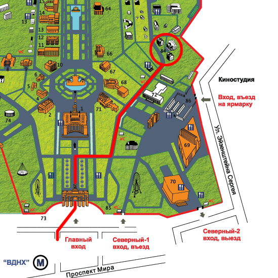

В заключение текущего цикла Учений в воскресенье, 22 апреля, Досточтимый Геше
Джампа Тинлей дарует Благословение Белой Тары.  Благословение Белой Тары -- это
обширный буддийский ритуал, предназначенный для устранения препятствий и
обретения благословения -- силы, которая может помочь измениться к лучшему.

Благословение будет проходить по адресу: м. ВДНХ, территория ВВЦ, павильон 84,
Дом культуры ВВЦ. Начало в 12-00, вход свободный. Приглашаются все желающие.

[role='clearfix']
Проезд: ст. метро ВДНХ, первый вагон из центра, вход через главные ворота ВВЦ,
примерно 100 метров пройти по главной аллее, затем повернуть направо и пройти
еще примерно 400 метров до ДК ВВЦ (павильон 84). link:/content/?q=node/240[Местоположение ДК на схеме:]

