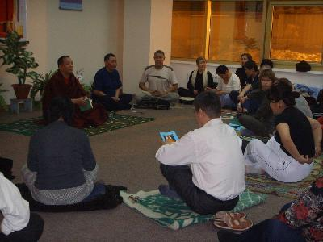
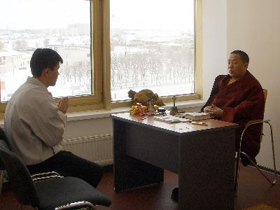

В средние века в Индии считалось, что человек должен прожить долгую жизнь,
накопить опыт и в старости уйти от суеты, посвятив себя йоге. Современная
цивилизация, увы, не дает возможностей следовать этим мудрым предписаниям.
А плохая экология, нездоровый образ жизни, особенно в городе, заставляют людей
задумываться о состоянии души и тела чуть ли не с двадцатилетнего возраста.
Аэробика, фитнес, бодибилдинг - все эти модные поветрия уступили место йоге,
одной из шести традиционных систем индийской философии. В числе ее обожателей
голливудские звезды - Мадонна, Гвинет Пэлтроу, Вуди Харрельсон и другие. У нас,
конечно, не Голливуд, но йогу с успехом практикуют и многие простые элистинцы.

Каждый вечер, за исключением понедельника, в хуруле "Золотая обитель Будды
Шакьямуни" проходят занятия по дыхательной гимнастике. Десятки горожан, пожилых
и молодых, спешат сюда с ковриками и книжками. Занятия проводит гелонг Таши
Гьямцо, или, как все его уважительно называют, Таши ла.

В городе образовался своего рода клуб йогистов. Самые преданные поклонники
учения посещали занятия еще в старом хуруле по улице Лермонтова. Люди еле
размещались в тесных комнатках, коридорчике, но занимались с таким же
энтузиазмом, как сейчас в просторном, залитом светом зале Алтн-сюме.

Таши Гьямцо в Калмыкии почти три года, до этого жил и практиковал йогу в разных
регионах России. Сначала была Бурятия. В 1993 году руководство Традиционной
буддийской сангхи России попросило Его Святейшество Далай-ламу XIV прислать
группу тибетских монахов для преподавания в бурятских дацанах. Таши Гьямцо
приехал в составе этой делегации и обучал хубураков (учащихся) в Иволгинском
дацане. Впоследствии мастера стали приглашать проводить занятия в разные
города: Томск, Омск, Новосибирск, Москва, Ростов и, наконец, Элиста.

Калмыцкие верующие и миряне хорошо знают Таши ла еще и как врача тибетской
медицины. Он также принимает участие во всех общих молебнах хурула, ведет
индивидуальный прием. Сотрудники хурула из числа местных волонтеров помогли ему
подготовить небольшой сборник упражнений по йоге с краткими аннотациями.
В книжке с простым бумажным переплетом собрано сорок видов упражнений. Сейчас
он разрабатывает дополнительный комплекс, помогающий при заболеваниях сердца,
слабой нервной системе, высоком артериальном давлении. Эти недуги очень
распространены среди калмыков.

Таши Гьямцо родился в восточном Тибете. Учился в монастыре Лавран, затем
в индийском Дрепунг Гоманге. Медитировал три года и три месяца в пещере, провел
одиночный ритрит по шаматхе - методике глубокого сосредоточения. "Йога очищает
организм от болезней, развивает ясность ума, говорит буддийский мастер. Это не
просто лечебная гимнастика в комплексе с дыхательными упражнениями, а образ
жизни. Считается, что йог должен уметь легко ходить по битому стеклу, надолгое
время задерживать дыхание или останавливать сердце. В принципе, все это
возможно, но не самое главное. Йога, прежде всего, помогает человеку узнать
больше о своем теле, о его скрытых ресурсах.

Занятия йогой очень полезны для женщин, хорошо стимулируют работу внутренних
органов, что помогает при беременности и родах. Ее можно практиковать в любом
возрасте, главное - постоянная практика".

… Однажды моя знакомая, которую можно причислить к постоянным ученикам Таши ла,
пригласила меня на занятие. Честно сказать, нелегко было преодолеть усталость,
вызванную многочасовым сидением за компьютером, по окончании рабочего дня
хотелось только вкусно поесть и завалиться на диван.

Зато потом не знала, как отблагодарить знакомую. Всего час занятий и физическое
напряжение, раздражительность как рукой сняло. По телу разлилась теплота, стала
чувствовать себя легко и свободно. Какое-то время я с усердием посещала
занятия, потом снова потонула в рабочей круговерти. О чем сейчас очень жалею.
Хотя говорят, что после курса йоги с наставником можно заниматься упражнениями
и дома. Но опять-таки, то мешают бытовые хлопоты, то отвлекают домочадцы…

Ташила подарил мне на память свой сборник и посоветовал: "Для начала просто
расстели коврик. Посмотришь на него сегодня, завтра, авось на пятый день
захочется сделать хотя бы обыкновенную зарядку". Пожалуй, так и сделаю.

Источник: Известия Калмыкии +
Валентина ЭРЕНДЖЕНОВА
